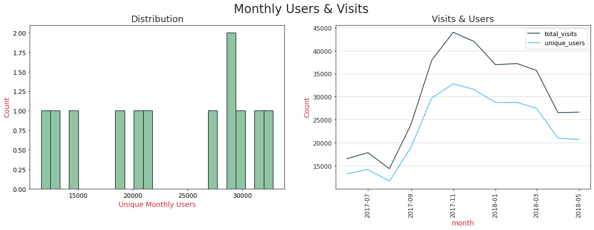
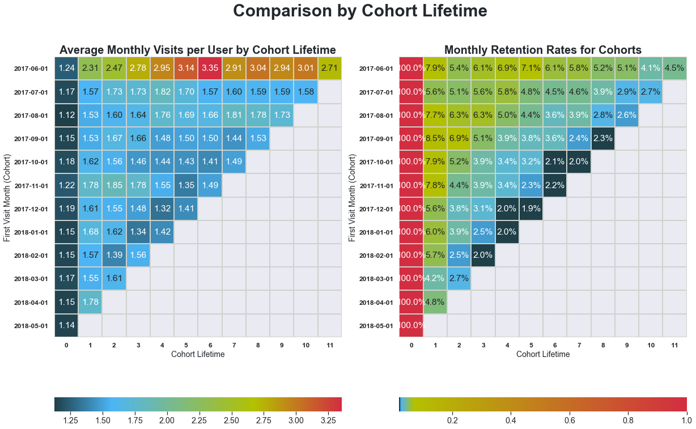

# Cohort Analysis

The task is to help optimize marketing expenses of a company that 

**The Datasets:**
* Server logs with data on visits from June 2017 through May 2018
* Dump file with all orders for the period
* Marketing expenses statistics

**The Tasks:**
* How people use the product
* When they start to buy
* How much money each customer brings
* When they pay off

### Conclusions
During our analysis we found out that these are the most profitable cohorts, sources and devices:

* Most of our users use a desktop device to visit our website, the also spend more time on the website than touch device users
* The customers that already visited our website one year ago tend to visit the site more often and make more purchases
* Most users buy on their first visit or within the first week. After that they might return in later months for additional purchases
  

* The cost of acquiring new customers is around USD 9.00, but we spend more in the last month.
* The average amount of money a customer spends during their lifetime is USD 10.00
* Most cohorts only reach their ROMI after 10 months
* Customers spend more per order when they come from sources #1 or #2 but the number of buyers that order on their first visit come from sources #3, #5 and #10
* Only two sources reached their ROMI, some others are close, but some like #3 are far from reaching it.
* We should concentrate our marketing efforts on sources that see early conversions, like #5 and #10 and sources that see the highest and fastest revenue like #1, #2 and #5.

source_id|revenue|costs|profit
---|---|---|---
1|45298|20833|24465
2|61663|42806|18857
3|43146|141321|-98174
4|48308|61073|-12765
5|45248|51757|-6508
7|1.22|-|-
9|3991|5517|-1525
10|4398|5822|-1424

We spend USD 77.000 more than we made, we need to cut back the marketing budget by at least this amount.

We should cut back the budget on source #3 where a lot of users converted early, and the number of buyers was the biggest, but they only spend USD 4.00 on average. We never came close to reaching ROMI from this source so maybe we should abandon this marketing channel altogether. Since we spend USD 141.321 on this source alone and only made USD 43.146 in return, abandoning this source would already gain us almost USD 100.000 which we could invest in more profitable sources.